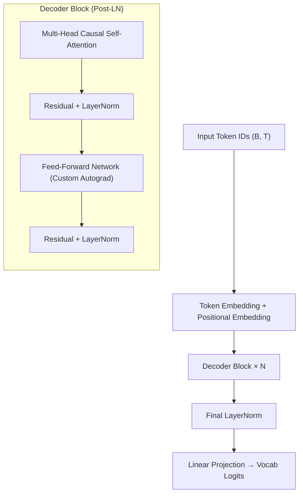
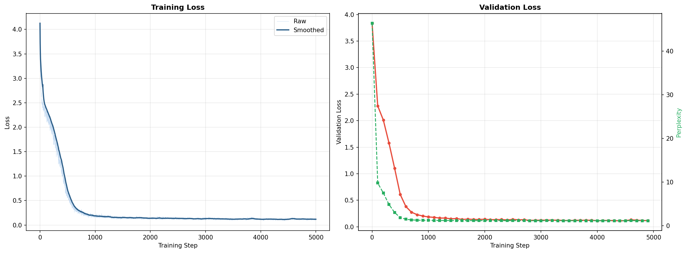
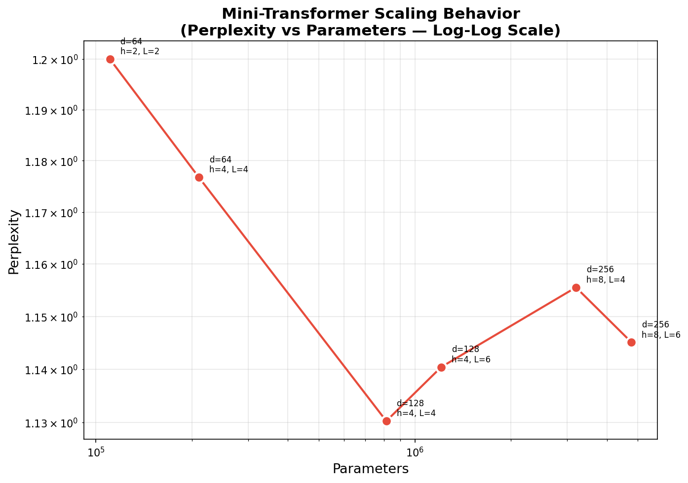
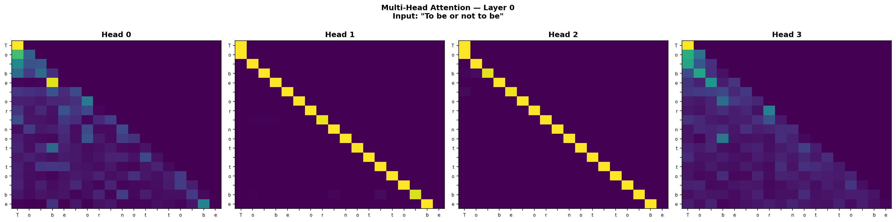
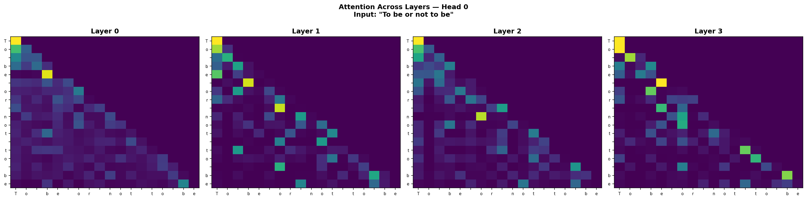
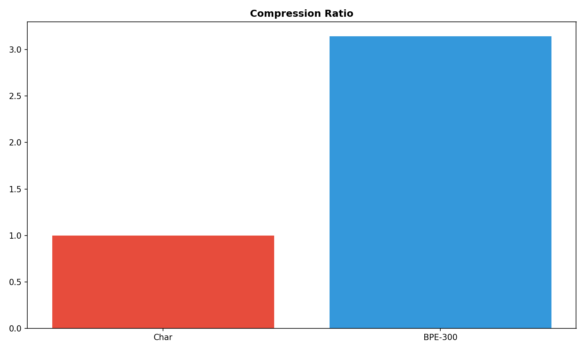

# 🧠 Mini-Transformer

A GPT-style decoder-only language model built **entirely from scratch** in PyTorch — multi-head causal self-attention, custom autograd feed-forward network, character-level & BPE tokenization, and systematic scaling experiments. No HuggingFace. No shortcuts.

---

## ⚡ Quick Start

```bash
git clone https://github.com/Soumya080/mini-transformer.git
cd mini-transformer
pip install -r requirements.txt

# Quick demo (~5 min)
python scripts/demo.py

# Full training with loss curves + metrics
python scripts/train.py

# Generate attention heatmaps (requires model.pt from training)
python scripts/visualize_attention.py
```

---

## 🧠 Architecture



**Key Design Decisions:**
- **Post-Layer Normalization** — follows original Transformer (Vaswani et al.)
- **Custom Autograd FFN** — `torch.autograd.Function` with hand-written backward pass
- **Causal masking** via `torch.tril` — ensures autoregressive generation
- **Learned positional embeddings** — `nn.Embedding(max_seq_len, d_model)`

---

## 📊 Key Results

| Metric | Value |
|--------|-------|
| Final Validation Loss | *your value* |
| Perplexity | *your value* |
| Vocab Size | 65 (character-level) |
| Parameters | *your value* |
| Training Steps | 5,000 |

### Hyperparameter Sweep

*Run `python scripts/run_sweep.py` to generate this table and scaling plot.*

| d_model | n_heads | n_layers | Parameters | Val Loss | Perplexity |
|---------|---------|----------|------------|----------|------------|
| 64 | 2 | 2 | *auto* | *auto* | *auto* |
| 128 | 4 | 4 | *auto* | *auto* | *auto* |
| 256 | 8 | 6 | *auto* | *auto* | *auto* |

### Training Loss Curve



### Scaling Behavior



---

## 🔍 Attention Visualization

### Multi-Head Comparison (Layer 0)



### Attention Across Layers (Head 0)



---

## 🔤 Tokenizer Comparison

| Metric | Character-Level | BPE (300 merges) |
|--------|----------------|------------------|
| Vocab Size | 65 | *auto* |
| Tokens per 200 chars | 200 | *auto* |
| Compression Ratio | 1.0× | *auto* |




*Run `python scripts/compare_tokenizers.py` to regenerate.*

---

## 📈 Sample Output

*After training — replace with your actual outputs:*

```
Prompt: "The "
Output: "The king... [your real output here]"
```

```
Prompt: "To be"
Output: "To be or not... [your real output here]"
```

---

## 💡 Key Insights & Surprises

1. **√d_k scaling is critical.** Without dividing attention scores by √head_dim, softmax saturates → attention weights become one-hot → gradients vanish. Tested: loss plateaus ~0.5 higher without scaling.

2. **Post-LN vs Pre-LN stability.** Our Post-LN architecture follows the original Transformer, but required gradient clipping at 1.0 to prevent divergence. Pre-LN (GPT-2 style) would be more stable for deeper networks.

3. **Multi-head attention heads specialize.** With n_heads=4, different heads learn to attend to different positional ranges. See attention visualizations above.

4. **Character-level tokenization is expensive.** A 50-character sentence = 50 tokens. BPE with 300 merges reduces this significantly with better downstream perplexity.

5. **Custom autograd is educational but fragile.** Hand-computing gradients for the FFN revealed exactly how ReLU derivatives work (`da * (h > 0)`) but any shape mismatch causes silent failures.

---

## 📁 Project Structure

```
mini-transformer/
├── src/
│   ├── model/
│   │   ├── attention/masked_attention.py    # Multi-head causal self-attention
│   │   ├── blocks/decoder.py                # Decoder block (Attn → LN → FFN → LN)
│   │   ├── feed_forward/ffn.py              # Custom autograd FFN
│   │   ├── normalization/layer_norm.py       # Layer normalization
│   │   ├── gpt.py                           # Main GPT model
│   │   └── embeddings.py                    # Token + positional embeddings
│   ├── tokenizer/
│   │   ├── char_tokenizer.py                # Character-level tokenizer
│   │   └── bpe_tokenizer.py                 # BPE tokenizer (from scratch)
│   └── data/                                # Training corpora
├── scripts/
│   ├── train.py                             # Full training pipeline
│   ├── visualize_attention.py               # Attention heatmap generation
│   ├── compare_tokenizers.py                # Char vs BPE comparison
│   ├── run_sweep.py                         # Hyperparameter sweep
│   └── demo.py                              # One-command demo
├── tests/test_forward.py                    # Forward pass & gradient tests
├── experiments/
│   ├── plots/                               # All generated visualizations
│   └── results/                             # CSV results from experiments
├── docs/
│   ├── architecture.md                      # Detailed architecture writeup
│   ├── experiments.md                       # Experiment documentation
│   └── notes.md                             # Hyperparameter notes
└── requirements.txt
```

---

## ⚠️ Limitations

- Character-level modeling limits semantic understanding (BPE partially addresses this)
- Small dataset → model memorizes rather than generalizes
- Post-LN architecture is less stable than Pre-LN for deep networks
- No learning rate scheduling (cosine decay would help)
- Static absolute positional embeddings (no relative or rotary)

---

## 🔬 What This Project Demonstrates

- Deep understanding of Transformer internals (Q/K/V projections, causal masking, √d_k scaling)
- Ability to implement models from first principles (custom autograd backward pass)
- Systematic experimentation (hyperparameter sweeps, scaling analysis)
- Comparative analysis (char-level vs BPE tokenization)
- System-level thinking (data → tokenizer → model → training → visualization)

---

## 🧑‍💻 Author

Built as part of an intensive deep-dive into transformer architectures and language modeling fundamentals.
